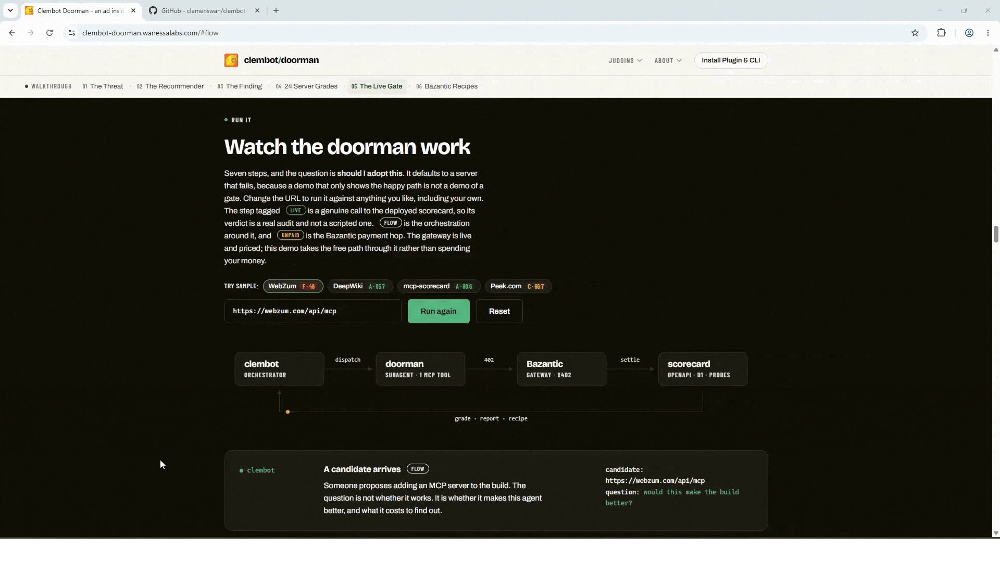

# Clembot Doorman

> **The Package Manager & Security Doorman for Clembot.**  
> Inspect your build. Recommend vetted MCPs from prompt history. Block rogue tools before they reach context.

[](https://clembot-doorman.wanessalabs.com)
[](https://clembot-doorman.bazgateway.com)
[](RUNBOOK.md)
[](LICENSE)

---

## TL;DR · What is Clembot Doorman?

**Clembot is built in many versions, with the latest utilizing Claude Code and a custom combination of agent harnesses.** While AI agents need tools to do real work, loading raw MCP servers blindly introduces **in-context steering ads**, prompt injection risks, and token-draining schema hallucination. 

1. **Inspect & Recommend (`doorman doctor` & `doorman needs`)**  
   Inspects your active build (`doorman doctor`). Reads local prompt history (`~/.claude/projects/`), identifies capability gaps across 12 taxonomies, and recommends safe, pre-graded MCP tools from `scorecard.wanessalabs.com/feed`.
2. **Zero-Dependency Offline Security Gate (`PreToolUse` hook)**  
   A 180-line offline hook blocks hostile or unapproved tools locally (`exit 2`). Deny beats allow; rogue servers never reach your agent's context window.
3. **Arm with Bazantic Recipes (`recipe.md`)**  
   Turns raw, unpredictable APIs into bounded, high-performing tools via structured `recipe.md` guidance. Built and verified against the Bazantic gateway (`clembot-doorman.bazgateway.com`).



*A real run against a real server. The grade, the hard fail, and the arithmetic are live values, not a mockup: `webzum.com/api/mcp` scores **89.9% on configuration** and still fails, because one tool description injects **6,290 characters of unprompted upsell and competitor steering** directly into your agent's context window. One cent through the Bazantic gateway answered a question that would have cost $54.47 to measure in an unguided LLM loop. [Run it live in the simulator](https://clembot-doorman.wanessalabs.com/#flow).*

---

## What this is for

Doorman measures whether a candidate tool actually helps **your** agent, and gives you a report about **your** build.

That emphasis is the whole design. A benchmark someone else ran tells you whether a tool helped *their* agent. Whether it helps yours depends on your harness, your model, your existing servers, and what your agents actually do. Those differ enough that a central verdict is close to meaningless.

So this is a thing you install, not a service you ask:

- **It runs on your machine.** Local static checks, prompt history parsing, and throwaway Docker sandboxes.
- **It drives the harness you already run.** Native integration with Claude Code and generic agent harnesses.
- **It spends from your own account**, bounded by a ceiling you set (`--max-cost`), while the inspection and recommendation layers spend nothing at all.
- **Nothing is sent to us.** There is no account here to create, no telemetry, and no tracking server in the path. We never see your prompt history or results.

The verdict is yours, produced on your machine, from numbers we never receive.

## The Toolchain: Five Layers, Cheapest First

| Layer | Command | Needs | Answers |
|---|---|---|---|
| **L0** | `doorman doctor` | nothing | **What is in my build?** Which harness, which MCP servers are reachable, how many subagents hold tools, and is the gate wired? |
| **L0.5** | `doorman needs [path]` | nothing (local history) | **What does my build keep asking for?** Analyzes prompt history (`~/.claude/projects/`), identifies unmet capabilities, and recommends safe, pre-graded tools from the feed. |
| **L1** | `doorman report <link>` | nothing (read-only) | **Is this candidate safe?** Audits protocol compliance, schema bloat, and scans tool descriptions for in-context steering ads and prompt injection. |
| **L2** | `PreToolUse hook` (`gate`) | local registry | **Block rogue tools offline.** 180-line zero-dependency hook that intercepts tool calls before LLM execution (`exit 2`). Deny beats allow. |
| **L3** | `doorman eval <link> --task <f>` | Docker + agent key | **Does this tool actually improve output?** A/B comparative benchmark across two isolated containers, bounded by a strict cost ceiling (`--max-cost`). |

**L0, L0.5, and L1 need no model key, no Docker, and no network spend.** Finding out whether a tool is safe, or what your agents are missing, costs nothing.

## What is in this repo

| Path | What it is |
|---|---|
| `doorman/cli/` | The CLI: `doctor`, `needs`, `report`, `watch`, `eval`. Zero runtime dependencies. |
| `doorman/` | The gate you install: a 180-line `PreToolUse` hook that blocks unapproved MCP tools, a subagent that vets them, and a registry you own. |
| `mcp-scorecard/` | The grading service behind L1. Cloudflare Worker + D1 + a local probe runner. |
| `site/` | The live product & explainer at [clembot-doorman.wanessalabs.com](https://clembot-doorman.wanessalabs.com). |
| `fixtures/planted-bad-mcp/` | A deliberately hostile MCP server, deployed, so the demo denies something real instead of a line in a JSON file. |

## Quickstart & Installation

**The answer depends on your stack, so run it on yours.**

There are two halves and you want both. The **plugin** is the gate that blocks
untrusted servers at the point of use. The **CLI** is the measurement that
decides what belongs on your trust list. Installing one does not install the
other.

### 1. The plugin: the gate, `/doorman`, `/vet`, and the subagent

```bash
claude plugin marketplace add clemenswan/clembot-doorman
claude plugin install clembot-doorman
```

Then, in Claude Code:

```
/doorman
```

That is the front door. With no arguments it tells you what is gating this
build, which trust list is actually in force, and how many of the servers it
trusts were **graded** versus simply allowed by you. Everything else is a branch
off it: `/doorman allow <server>`, `/doorman check <url>`, `/doorman needs`.

> **The gate starts strict, and you should expect to be blocked.** It ships
> trusting two servers. Anything else, including connectors you already use, is
> UNKNOWN and fails closed. That is the design: an ungraded server is not a
> trusted one. When it blocks something, it prints the exact command to allow
> it.

Verify what actually loaded, because a manifest that validates can still ship
components that never register:

```bash
claude plugin details clembot-doorman
#   Skills (3)  doorman, doorman-guide, vet
#   Agents (1)  doorman
#   Hooks (1)   PreToolUse
#   MCP servers (1)  scorecard
```

### 2. The CLI: doctor, needs, report, watch, eval

```bash
npm i -g clembot-doorman
doorman --version
```

Node 20+. Zero runtime dependencies, deliberately: every dependency is one more thing that can fail to install on your machine.

**New here?** [`WALKTHROUGH.md`](WALKTHROUGH.md) runs the first ten minutes
against three real builds: one with a long history, one brand new, and one in
between. The output in it is captured from real runs, not written by hand.

### Core Workflow

```bash
# 1. What is in YOUR build. Free, local, read-only.
#    No model, no container, no network.
doorman doctor

# 2. What do your prompts keep reaching for?
#    Reads prompt history, identifies capability gaps, recommends vetted tools.
doorman needs

# 3. Grade a candidate server by its implementation before installing.
#    Scans for hidden steering ads, injection patterns, and protocol violations.
doorman report https://webzum.com/api/mcp

# 4. Stream newly graded servers from the feed and flag blocked/unreviewed tools.
doorman watch --all

# 5. Does a candidate actually help YOUR agent? Two sandboxes, identical
#    except one install layer, driving the harness you already run.
doorman eval npm:some-candidate --task evals/tasks/url-to-note.yaml --agent claude-code --max-cost 2
```

### What `doorman doctor` tells you

Which harness the project is set up for, every MCP server your agents can reach
and where each was declared, how many subagents hold MCP tools, and whether the
gate is installed **and wired**. Those last two are different states, and the
dangerous one is the middle: a gate that is present but not wired is not
running, and looks exactly like one that is. Both are quiet.

### Your key, your machine

`--agent claude-code` drives the agent you already run. The credential your
harness already uses is passed straight into a local container. It is never
written to a file, never logged, and never leaves your machine except to the
provider you already pay.

An adapter that cannot measure something reports it as **not measured** rather
than estimating it. `--agent exec "<command>"` will drive any harness at all,
and reports success rate and wall time only, because a command doorman knows
nothing about cannot be asked how many turns it took.

### The bill is bounded before it starts

An agent loop resends the whole conversation every turn, so cost grows with the
**square** of the turn count. A 24-turn cap authorises far more than it looks
like: on Sonnet, three runs per arm is **$54 at worst**.

So `--max-cost` is the input and the turn cap is **derived from it**. A ceiling
of $2 is a ceiling of $2. Add `--estimate` to print the worst case and spend
nothing:

```bash
doorman eval npm:some-candidate --task <file> --max-cost 2 --estimate
```

It refuses rather than shaving: a ceiling too small for even a three-turn run
stops and shows the arithmetic. The permit ledger is the same one the doorman
uses on its own outbound spend.

Fewer than three runs per arm cannot reach ADOPT, because one sample cannot be
told apart from luck. DECLINE stays reachable at any run count, so a cheap run
is still worth doing: it can tell you a candidate is bad, just not that one is
good.

---

## Step-by-Step Developer Walkthrough & Skill Management

A complete guide for net-new Claude Code / Clembot builds, prompt history analysis, and managing existing skill rosters.

### 1. Fresh Init Walkthrough (`claude init` → `doorman doctor` → `doorman install`)

When you run `claude init` in an empty repository, Claude Code sets up baseline configuration (`CLAUDE.md`, `.claude/settings.json`). Before installing tools, run `doorman doctor`:

```bash
doorman doctor
```

**Verbatim output on a fresh build:**
```markdown
# Your build

`C:\Users\username\my-new-project`

Read-only. Nothing here was executed, sent anywhere, or billed.

## Harness

- **Claude Code** (CLAUDE.md)

## MCP servers this project can reach

None declared. Nothing to grade yet, and nothing to gate.

## Agents

No .claude/agents/ directory.

## The gate

**not installed**

- hook present: no
- wired in settings.json: no
- registry present: no

---
_doorman doctor. Static, local, free. It reports what is here; it does not
say whether any of it works. That is doorman report and doorman eval._
```

To wire the local deterministic gate before adding any external MCP servers:
```bash
doorman install
```
This registers `doorman/.claude/hooks/mcp-gate.sh` into `.claude/settings.json` and creates `registry/allowlist.json`. Unapproved tools or payload injections are stopped at **exit 2** before reaching context.

---

### 2. Elevate Your Build with Prompt Recommendations (`doorman needs`)

After working in your project for a few sessions, run `doorman needs`:

```bash
doorman needs
```

**How it works:**
1. **Local Transcript Ingestion**: Reads `~/.claude/projects/<slug>/*.jsonl`. Filters out tool results, compacted summaries, and slash command templates to isolate the sentences *you actually typed*.
2. **12 Capability Taxonomies**: Categorizes asks into `docs-lookup`, `web-search`, `database`, `browser-automation`, `cloud-deploy`, `observability`, `payments`, `comms`, `design-assets`, `knowledge-base`, `code-host`, `data-files`.
3. **Public Feed Matching**: Compares unmet capabilities against the free [Scorecard Feed](https://scorecard.wanessalabs.com/feed).

**Verbatim output:**
```text
doorman needs — 42 prompts read from this build’s own history
  history: ~/.claude/projects/C--my-new-project
  feed: 24 graded rows

UNMET    Current documentation for a library it does not know
         14 prompts across 3 sessions  ·  matched "latest docs", "deepwiki"
         > …can you look up the latest docs for drizzle orm…
         > …check the documentation for cloudflare workers assets…
         worth-measuring  DeepWiki MCP           [A (85.7)]  matched "docs"
                          https://mcp.deepwiki.com/mcp
         worth-measuring  Cloudflare Docs MCP    [A (94.2)]  matched "documentation"
                          https://docs.mcp.cloudflare.com/mcp

UNMET    Driving a real browser
         6 prompts across 2 sessions  ·  matched "screenshot the page", "playwright"
         > …take a screenshot of the landing page at 390px…
         worth-measuring  Peek Browser MCP       [C (66.7)]  matched "screenshot"
                          https://mcp.peek.com

UNMET    Reading the live web
         5 prompts across 1 sessions  ·  matched "search online"
         > …search online for the error code…
         blocked          WebZum Search          [F (49.0)]  matched "search"
                          hard fail: injection-shaped content in tool:host_site.description
                          https://webzum.com/api/mcp

GAP      Production errors and logs
         3 prompts across 1 sessions  ·  matched "tail the logs"
         > …tail the logs from production…
         nothing graded covers this. The feed has the gap, not your build.

3 unmet, 1 of them with nothing graded to offer.

What this is: your own prompts, counted, against capability text those
candidates published about themselves. Nothing here was driven, so
nothing here is a claim that a server works. `worth-measuring` means
exactly that — run `doorman eval` with your key and find out.
```

- **`worth-measuring`**: Verified Grade A/B servers matching your exact needs.
- **`blocked`**: Identifies hostile or compromised servers (e.g. WebZum prompt injection).
- **`GAP`**: Honestly states when the ecosystem has no graded server for that need yet.

---

### 3. What If Your Build Already Has Skills or Tools?

Doorman is specifically designed to stop "skill sprawl" and prevent duplicate tools:

1. **Automatic Suppression (`coveredBy(inv)`)**:
   In `doorman needs`, if a capability term matches a tool already declared in `.mcp.json` or `.claude/settings.json`, it labels the need:
   ```text
   COVERED  Current documentation for a library it does not know
            already covered by: DeepWiki MCP (mcp__deepwiki_lookup)
   ```
   Candidate recommendations for that need are **suppressed** so your output stays focused on real gaps.

2. **Adverse Drift Detection (`doorman watch`)**:
   When you run `doorman watch`, any candidate server already in your inventory is tagged `already-installed`. If an installed server is downgraded or caught with prompt injection on the feed, `watch` raises an immediate security alert.

2a. **Push, without a daemon and without telemetry**:
   Nobody can push to a laptop behind NAT that is asleep half the day, so the
   push here is not a new transport. It is the poll going invisible. A
   SessionStart hook prints a digest that is already on disk, then fires a
   detached refresh so the next session is current. The hook makes no network
   call: one that waited on a fetch would make every session start as slow as
   the worst network it has seen, and offline would make them all fail.

   ```text
   ## doorman

   1 newly graded server this build does not have:
   - **A** 85.71/100, model not recorded https://mcp.deepwiki.com/mcp
     not measured: behavioral, guidance
   ```

   Three rules, and each one is a notification product failing if broken. It
   is **silent when nothing is new**, because a hook that reports "nothing new"
   every morning teaches you to skip past the one morning it matters. It
   **announces nothing on the first run**, because with no cursor the feed
   returns everything graded so far and 26 rows is a catalogue, not news. And a
   digest is **shown exactly once**, because the same three servers every
   morning is how a notification becomes furniture.

2b. **Popularity and trend, as a second axis (`GET /feed`, `?sort=trending`)**:
   Every feed row carries a `popularity` block: Smithery use counts, npm weekly
   downloads and GitHub stars, swept daily, with a median percentile and a
   trend.

   It is **never part of the score**. The grade is what happened when an agent
   drove the server; popularity is how many people installed it without asking
   that. A popular F is the most useful row this feed can publish, and a
   blended number is the one thing guaranteed to bury it.

   Counts are **ranked within each source and never summed across them**:
   87,579 Smithery uses, 4,200 npm downloads and 1,100 stars are three units
   counting three populations, and adding them makes a meaningless number that
   still sorts confidently. `sources_measured` says how many sources backed the
   percentile, because a server ranked on one and a server ranked on three are
   not equally known. A trend needs two readings at least 12 hours apart, so a
   newly tracked server reports `null` rather than zero growth, and a source
   that could not be read is **absent rather than zero**.

   **Doorman's own install counts are refused as a fourth source.** They would
   be the best popularity signal available to anyone, and collecting them needs
   telemetry. That would sell the guarantee that makes `watch` and `needs`
   worth running at all: your inventory never leaves your machine.

3. **Frontmatter Arithmetic (30 KB vs 640 KB)**:
   Doorman reads only YAML frontmatter (`name`, `description`) from `.claude/skills/*/SKILL.md` and `.claude/agents/*.md`. In our production vault, reading full markdown bodies was **642 KB**; reading frontmatter was **30 KB**. This allows the complete roster to be reviewed by a model in a single prompt without bloating context.

4. **The Two-Phase Fit Review (`node scripts/vet.mjs <candidate> --dry-run`)**:
   Before spending any money or tokens on external audits, the Fit Review compares the candidate against your existing skills. If an existing skill already covers it, it returns `REDUNDANT` and halts at Phase 1 ($0.00 spent):
   ```text
   candidate  https://github.com/example/git-mcp
   inventory  C:\Users\username\my-project — 3 agents, 22 skills, 1 mcp servers

   FIT        REDUNDANT
              Already covered by existing skill: git-pr covers reviewing and merging pull requests.

   Already covered by:
     - skill git-pr: handles GitHub pull requests and diff review locally

   STOPPED before the paid grade. $0.00 spent.
            Nothing was sent to the scorecard, and no client was built.
   ```

---

### 4. Running Doorman as an Agent Skill or Slash Command

- **As a Slash Command (`/vet <url>`)**: Create `.claude/commands/vet.md` calling `node scripts/vet.mjs $ARG --dry-run`. Type `/vet <url>` directly in your Claude Code chat to run the two-phase check.
- **As a Dedicated Subagent (`.claude/agents/doorman.md`)**: Sandbox tool evaluation by assigning a dedicated `doorman` agent holding only read tools and the Bazantic Scorecard gateway.
- **As a Harness Skill (`.claude/skills/doorman/SKILL.md`)**: Equip your agents to run `doorman doctor`, `doorman needs`, or `doorman report` during planning turns before proposing new tool installs.

---

### 5. Implementation Status: How Built Out Is This?

| Component | Status | Verification & Evidence |
|---|---|---|
| **Static Scanner (`doorman report <url>`)** | **Production Ready** | Live SSE handshake, tool schema linting, 6-pattern injection detection. [Caught WebZum injection](evidence/needs-demo/watch-blocked.txt) on live internet. |
| **Needs Engine (`doorman needs`)** | **Production Ready** | Parses real `~/.claude/projects/` JSONL prompts, deduplicates resumes, maps to 12 capability taxonomies, matches against [Scorecard Feed](https://scorecard.wanessalabs.com/feed). |
| **Harness Doctor (`doorman doctor`)** | **Production Ready** | Zero-dependency local scan. Detects Claude Code, Cursor, Windsurf, Copilot, Gemini; audits MCP configs and agent exposure. |
| **Security Gate (`mcp-gate.sh`)** | **Production Ready** | 180-line offline Bash hook. Passed 29/29 test suites in `test-gate.sh` (blocks unallowlisted tools, prevents shell escapes, enforces 5s timeout). |
| **Fit Review Engine (`fitReview`)** | **Production Ready** | Compares candidates against `.claude/skills/*/SKILL.md` frontmatter. Enforces temperature 0, strict JSON schema, and hallucination rejection. |
| **Budget & Spend Ledger** | **Production Ready** | Enforces per-run ($1) and per-day ($5) caps in USDC on Base; auto-releases unspent reserves on error. |
| **Bazantic x402 Gateway** | **Live in Production** | `clembot-doorman.bazgateway.com` live x402 challenge ($0.01 USDC on Base) + MCP SSE tool stream. |
| **Multi-Directory Skill Reading** | **Configuration Detail** | Currently looks in `.claude/skills/*/SKILL.md` by default. Set `DOORMAN_INVENTORY_ROOT` for alternate paths like `.agents/skills/`. |

---

## Live

| Surface | URL |
|---|---|
| Explainer site | https://clembot-doorman.wanessalabs.com |
| Developer Walkthrough | https://clembot-doorman.wanessalabs.com/guide.html |
| Scorecard API | https://scorecard.wanessalabs.com |
| OpenAPI spec | https://scorecard.wanessalabs.com/openapi.json (3.1.0) |
| Same spec as 3.0.3 | https://scorecard.wanessalabs.com/openapi-3.0.json |
| End-to-end runbook | [`RUNBOOK.md`](RUNBOOK.md) |
| Embeddable demo | https://clembot-doorman.wanessalabs.com/embed/flow.html |
| Where this is headed | https://clembot-doorman.wanessalabs.com/direction.html |
| Example badge | https://scorecard.wanessalabs.com/badge/https%3A%2F%2Fmcp.deepwiki.com%2Fmcp.svg |

Two real production audits, both queued through the API, claimed by a laptop
runner, graded, posted back:

| Server | Grade | Static layer | Audit | Tape |
|---|---|---|---|---|
| `mcp.deepwiki.com/mcp` | **A 85.71** | 85.71% | `9fbb3558` | [replay](https://scorecard.wanessalabs.com/grade/9fbb3558-8b6e-475b-9b6f-161b32bbb7a1/transcripts) |
| this service, graded by itself | **A 98.63** | 98.63% | `d4bc490c` | [replay](https://scorecard.wanessalabs.com/grade/d4bc490c-5e51-4fb7-be67-6ef6f5a0a0ea/transcripts) |
| our planted fixture | **F 49** | **91.78%** | `f468e5b8` | [replay](https://scorecard.wanessalabs.com/grade/f468e5b8-232a-43bb-9cb4-2ad680bab1ae/transcripts) |

**Read the static column twice.** The hostile server scores 91.78% on
configuration, higher than the A-graded one. It negotiates the protocol
correctly and would survive a config review. The F is entirely in what it tells
the agent reading it.

That is the whole argument, and it is why the planted server is a real deployed
server rather than a row in a denylist. It is also why the middle row is there:
the scorecard is itself an MCP server, it was graded by itself, and it had to
pass its own gate to be callable. Nothing here is exempt.

---

### Embed the demo

One file, no build step, no dependency on this repo at runtime. It runs the same
live call the site runs.

```html
<iframe src="https://clembot-doorman.wanessalabs.com/embed/flow.html"
        width="100%" height="1900" style="border:0" loading="lazy"
        title="Doorman: should I adopt this server?"></iframe>
```

Add `?api=` to point it at your own scorecard deployment.

It is **generated** by `node scripts/build-widget.mjs`, never hand-maintained: a
second hand-copied copy of a 12KB driver and a 45KB stylesheet drifts the first
time anyone edits either, and drifts silently, because both still run. The
builder carries a drift guard that refuses to write a widget whose Run button
would throw.

## Where this is headed

**A subscription that keeps an agent stack current.** New tools appear every
week. The useful question is not whether one is good, it is whether one is good
for the build you already have, and answering that repeatedly is a different
product from answering it once.

Full version, with the line between built and specified drawn where it actually
falls: **<https://clembot-doorman.wanessalabs.com/direction.html>**

### The split, and why it is the whole design

| Half | Runs | Who pays | Cost of the next subscriber |
|---|---|---|---|
| The grade | ours, cached, public tape | whoever asked first, once | **$0.00** |
| The fit | **your machine** | you, in tokens | their own |

A candidate is graded **once** and every subscriber reads that grade for
nothing, so the marginal cost of the thousandth subscriber is not another audit.
The half that is actually about you, your agent roster, your installed servers,
your allowlist, is read locally and never leaves. `doorman watch` makes exactly
one request, a `GET` for the feed, and that request says nothing about who is
asking. The privacy is not a policy, it is the shape of the thing.

### Working today

```bash
# the shared half: newly graded candidates, one row per server, free
curl https://scorecard.wanessalabs.com/feed

# the private half: which of those are new to THIS build
node doorman/cli/doorman.mjs watch . --all
```

`watch` sorts candidates into `already-installed`, `blocked`, `unreviewed` and
`skipped`. It will not tell you a candidate **fits**: that word belongs to the
fit review, which reads the candidate against your build with a model, and a
string match cannot earn it. Two tests exist for the sole purpose of stopping it
ever saying so.

### Why this needs a payment rail, in two lines

The useful price for "is this new tool worth your attention" is a fraction of a
cent, and card fees exceed the value of the thing being sold. The product is not
*nicer* on a micropayment rail, it is impossible without one.

And a grade is cached with its full transcript free forever, so one agent's cent
does not buy one answer. It funds a commons nobody could bill for directly.

### Finding candidates in the first place

`doorman discover` sweeps a public MCP registry and writes a candidate file, then
stops. It never enqueues and never spends.

```bash
node doorman/cli/doorman.mjs discover --pages 1
```

The registry returns only its own proxy, which needs its token, so the origin an
audit would need is not in the record. But the detail record ships the full tool
descriptions, so the static scan reads the exact surface an agent reads without
calling a single server.

**The first sweep is why the scan is now measured.** It flagged 15 of 100, and
two survived a hand check. The rest were ordinary documentation: a Slack
parameter that posts a reply to a conversation, an LLM testing tool whose job is
to accept a system prompt, `system:` as a docstring parameter name, and five
vendors saying "use this instead of" about another tool in their own server.
Five patterns were tightened and the same sweep now flags two.

All fifteen strings live in `doorman/test/discover-precision.test.mjs`, verbatim
and named, next to the strings that must keep tripping. The baseline is a
ratchet: it fails if precision gets worse, and demands the number be lowered in
the commit that improves it.

### Not built, and said so

The released Bazantic CLI has **no marketplace discovery command**, so ingest is
still whatever gets pointed at the feed. Nothing has been settled through the
gateway even once. And 70 of every 100 points on every grade in the feed are
unmeasured until an `ANTHROPIC_API_KEY` exists.

## The grade

Three layers, weighted 30 / 50 / 20, banded A at 85, B at 70, C at 50, F below.

**Static (30).** Wraps the `mcpscore` CLI. Protocol version, TLS, schema validity,
annotations, pagination. Its raw output has a *moving denominator*, because rules
get skipped per server, so it is normalised to a percentage before anything is
compared. A server scoring 78/91 is worse than one scoring 64/73, and only the
normalised number shows it.

**Behavioural (50).** A real agent, a pinned model, temperature 0, three runs per
probe. This is the half that reading cannot produce.

**Guidance delta (20).** The same cold task re-run with the drafted recipe in the
agent's system prompt. Scored as *recovered headroom*, not raw delta, so a server
that was already strong is not punished for having little room to improve.

The recipe is derived from the very runs it is then measured against, so this is
deliberately **not** a generalisation claim. It answers a narrower question, and
the narrow question is the useful one:

> We told the agent, in plain language, exactly what went wrong last time.
> Did that fix it?

A server that recovers can be put safely behind a recipe. A server that still
fails with the correction sitting in front of it is one where no amount of
documentation saves you, and that is the finding worth having. A **low** guidance
score is the interesting result; a high one is expected.

Four gates stop it reporting a number nobody can defend, and each has a mutation
check. It is `not measured` when the recipe derived no rules, when `cold_open`
never produced a baseline, when the cold run already scored 100 (zero headroom
would otherwise pay a perfect server twenty free points), and whenever the model
probes did not run. The guided run is scored **separately and kept out of the
behavioural mean**, or a server would be paid twice for one recovery. The guided
agent never sees the grade, the band, or the hard-fail banner: feed it
"Do not use this server" and the delta measures our own warning.

Two hard fails cap a grade at F regardless of everything else: injection-shaped
content in the advertised strings, and a transport that is not TLS.

### Three properties worth stating plainly

1. **An unmeasured layer is not a zero.** If the guidance delta did not run, its
   weight is removed and the other two renormalise to 37.5 / 62.5. Scoring it zero
   against a 20-point weight would drag every honest partial audit into a failing
   band. That is lying with arithmetic, and there is a test for it.

2. **A grade is relative to the model that produced it.** The model id is on the
   audit, in the report, and on the badge. Grades from different models are not
   comparable.

3. **A skipped probe is excluded, not failed.** Ambiguity only fires when tool
   descriptions overlap; Chain is skipped under three tools. A two-tool server is
   not worse for having nothing to chain.

---

## The six probes

| # | Probe | The question it answers |
|---|---|---|
| 1 | Handshake and inventory | Is there anything here at all? Dead servers exit free. |
| 2 | Cold open | Can an agent that has never seen this succeed on the first try? |
| 3 | Ambiguity gauntlet | Do two overlapping descriptions actually distinguish themselves? |
| 4 | Bad input recovery | Can an agent self-correct from this error message in two turns? |
| 5 | Chain test | Do these outputs compose, or only look like they should? |
| 6 | Injection sniff | Is this documentation, or is it giving my agent orders? |

Probe 4 grades the **error message**, not the agent. "Invalid input" and
"missing required `repoName` (string, e.g. `facebook/react`)" are the same failure
and completely different products.

Probe 6 is scan-only and never calls a tool. We do not execute a server to find
out whether it is hostile. Because a hit caps the grade at F, which is a public
accusation about somebody else's software, it is deliberately conservative and
every hit records the pattern plus the offending text verbatim.

It also needs no model, so it is the one probe that **runs without an API key**.
Dropping it alongside the model-driven probes under `--static-only` would have
made the cheapest audits the ones that stayed quiet about hostile tool
descriptions. The planted fixture grades C without it and F with it.

---

## Why the Worker does not grade anything

`mcpscore` is Python and pulls in `cryptography`, `pydantic-core` and `cffi`,
which are native compiled extensions. A Cloudflare Worker cannot spawn a process
and Python Workers only load a curated package set. **The Worker physically
cannot run the static layer.**

So `POST /grade` returns **202 and an audit id**, a probe runner on a real machine
claims the work, and posts the result back. The API says this in its own
description rather than pretending to be synchronous and timing out.

The grade math lives in one isomorphic module that both halves import. `src/` is
typechecked against Cloudflare Workers types only, so a probe that reaches for a
Node API fails the build. The runner imports the *built* version of that module
rather than reimplementing it, because two implementations would drift and a
laptop-produced grade would stop meaning the same thing as a Worker-produced one.

---

## The gate

`doorman/.claude/hooks/mcp-gate.sh` runs before every MCP tool call.

- **No network.** Not a curl, not a DNS lookup. A gate that asks a server for
  permission is offline the moment the network is, and offline would mean allow.
- **No dependencies.** Bash builtins and coreutils. No jq, no node, no python.
  A gate that fails to start is a gate that fails open.
- **Fails closed.** Unparseable input, missing registry, unknown server,
  unreadable file: all block.
- **Exit 2, never exit 1.** Only exit 2 blocks a call. Exit 1 is treated as a
  script error and the call proceeds. A test asserts the file contains no exit 1.
- **Humans own the list.** Nothing writes the allowlist automatically. The poller
  reports changes and refuses to allowlist a hard fail even when the service says
  to.

The `doorman` subagent holds `Read` and exactly one MCP tool. The agent that
decides what to trust does not also carry capabilities an untrusted server could
talk it into using.

---

## Running it

> Proving the whole chain works, rather than one piece of it, is
> **`RUNBOOK.md`**: four ordered tests, three of them free, with the
> observed output of each.

```bash
# The service
cd mcp-scorecard
npm install
npm run migrate:local
npx wrangler dev --port 8799 --local

# Grade a real server, static layer only, no API key needed
pip install mcpscore
node runner/run.mjs --once --server https://mcp.deepwiki.com/mcp \
  --needed-for "look up how a public repository works" \
  --static-only --out ../evidence/deepwiki

# Full behavioural run (needs a key).
# `=...` is NOT a value: read the secret in rather than pasting a placeholder,
# which also keeps it out of shell history. A pasted "..." reaches the server
# as a wrong token and comes back 401, which reads as a broken credential
# rather than as a placeholder nobody substituted.
read -rsp 'ANTHROPIC_API_KEY: ' ANTHROPIC_API_KEY && export ANTHROPIC_API_KEY
# --once PRINTS ONLY. Add --out DIR to keep the evidence bundle, or queue the
# audit and use --poll below to publish it to the feed.
node runner/run.mjs --once --server https://mcp.deepwiki.com/mcp \
  --needed-for "look up how a public repository works" --out out/deepwiki

# Poll the queue
read -rsp 'RUNNER_TOKEN: ' RUNNER_TOKEN && export RUNNER_TOKEN
export SCORECARD_API=http://127.0.0.1:8799
node runner/run.mjs --poll
```

```bash
# Tests
cd mcp-scorecard && npm test          # 228 unit tests, 12 files
node test/smoke-grade.mjs             # grades a live public server
node test/smoke-api.mjs               # 75 assertions over the HTTP surface
cd ../doorman && bash test-gate.sh    # 29 adversarial gate tests
node test-poller.mjs                  # registry key derivation
```

---

## Status

Working and verified end to end **except the behavioural probes and the guidance
pass**, which have never been executed against a live model because no
`ANTHROPIC_API_KEY` has been supplied. Every guidance number in this repo comes
from a scripted stub in the test suite; none is a measurement of a real server. They are written, typechecked and unit-tested behind a mock-free
interface, and the runner refuses to fabricate results without a key: it marks
the audit failed and says why.

The chain those probes sit in was verified end to end against the deployed stack
on **3 September 2026**: a hostile server published, graded F through the live
queue, written into a registry that cites the audit id and evidence hash, and
blocked by the gate at exit 2 while the A-graded server passes at exit 0.

**No probe runner has been polling since that date.** The queue accepts work and
nothing claims it, so an audit requested today stays `queued` until someone
starts a runner. That is a second gap, separate from the missing key and more
immediate: `RUNBOOK.md` Test 2 closes it, costs nothing, and needs no key.

## Replay the tape

Every turn behind every grade is public and needs no token:

```
GET /grade/{audit_id}/transcripts              # JSONL, one object per turn
GET /grade/{audit_id}/transcripts?format=json  # grouped by probe run
```

Never paginated, never sampled. A grade is an accusation, and the evidence for
one cannot sit behind the token held by the party making it. It does not sit
behind the paywall either: `POST /grade` is the only chargeable route, and a
test asserts the transcripts stay free with payment fully switched on.

## Money

Two halves, and only one of them is finished.

**The spend cap is complete.** The doorman refuses to spend twice: once on fit
(does this system need it at all) and once on budget (can it afford to find
out). The second refusal is a **permit**, not a check. `scorecardClient` will
not be constructed without a budget and `enqueue()` will not run without an open
permit from it, because a required argument cannot be forgotten by a code path
that does not know the rule exists.

```
  budget     0 spent today, 5 of 5 left. Per-run cap 1.
  FIT        FITS -> scheduler
  REFUSED    the spend cap said no. $0.00 spent.
```

An **unknown price is not a free one**. `GET /price` is free and
unauthenticated, `/vet` reads it rather than assuming, and a price that cannot
be read stops the run. A client that defaults an unknown price to zero passes
every cap it has, forever. A `price_usdc: 0` from the service is a *discovered*
zero and spends cleanly; a missing field is not.

**Settlement is refused rather than faked.** The x402 **v2** challenge is real
and was implemented from the published spec rather than from memory, which
caught three errors that would otherwise have shipped: the header is
`PAYMENT-SIGNATURE` not `X-PAYMENT`, the field is `amount` not
`maxAmountRequired`, and `network` is CAIP-2 rather than a name. But there is no
wallet and no facilitator wired to this Worker, so a request arriving with a
`PAYMENT-SIGNATURE` is **refused**, using the protocol's own failure channel. A
paywall that opens for any string is worse than no paywall, because it looks
like protection.

Switching payment on without a configured recipient fails **closed** with 503
and publishes no placeholder address. An agent that paid a made-up recipient
would lose real money.

---

## Bazantic Integration & Prizes

Bazantic simplifies AI development by allowing developers to turn APIs into services agents can understand, use, and pay for via x402 micropayments.

Clembot Doorman uses Bazantic to:
1. **Agentify the Scorecard API** into a paid MCP service at `clembot-doorman.bazgateway.com`.
2. **Draft & Enforce Bazantic Recipes (`recipe.md`)** that turn raw, hallucination-prone MCP tools into safe, bounded, high-reliability agent tasks.

### ETHOnline 2026 Bazantic Prize Tracks

| Prize Track | Amount | How Clembot Doorman Qualifies |
|---|---|---|
| 🤖 **Help an Agent Use Your Hackathon Project** | $1,000 (Continuity) | **Autonomous agent usage without human guidance:** An agent can inspect its own Clembot build (`doorman doctor`), detect missing tools from its prompt history (`doorman needs`), query the live Bazantic Scorecard gateway, and install the local offline `PreToolUse` security hook. |
| 🍳 **Best Recipe Using EthGlobal Sponsor APIs** | $1,000 | **Raw MCP servers fail; Recipes succeed:** Our A/B evals demonstrate that raw MCP servers (like WebZum) inject thousands of characters of steering ads and cause token loops. Our drafted Bazantic Recipes (`recipe.md`) constrain schemas, enforce deterministic parameters, and prevent context window pollution. |
| 👨‍🍳 **Agentify a New API** | $1,000 | **Live x402 Micropayments Gateway:** Deployed OpenAPI 3.1 scorecard endpoints through the Bazantic gateway at `clembot-doorman.bazgateway.com` with per-grade pricing ($0.01/grade, free cached reads), key masking, and machine-readable tool generation. |

### Live Gateway Status

The gateway **Doorman** is active at `clembot-doorman.bazgateway.com`:
- **Endpoint**: `https://scorecard.wanessalabs.com`
- **Spec**: `https://scorecard.wanessalabs.com/openapi.json` (OpenAPI 3.1.0)
- **Auth**: `api-key` (forwards `GRADE_TOKEN` upstream, calling agents never see raw credentials)
- **Pricing**: $0.01 per behavioural grade, $0.00 for cached reads and feed streaming

### What a Recipe actually is

Not a flow, not a pipeline, not a DAG. **One task: typed inputs, a prompt, a
model, and a bound set of MCP tools**, published as a single MCP tool that any
agent can call. Sequencing happens inside one prompt, so a Recipe is a model
given tools rather than a declared sequence of steps.

Ingredients have to already exist on Bazantic as gateways. A Recipe cannot
invent a tool. So the gateway comes first and the Recipe second, always.

### Install and use it

```bash
# 1. the CLI, once
npm i -g @bazantic/cli
baz login

# 2. register the scorecard. Its OpenAPI 3.1 spec is already served,
#    so there is nothing to write for this step.
API=https://scorecard.wanessalabs.com
baz gateway add --endpoint $API --spec-url $API/openapi.json \
  --auth-type api-key \
  --name "MCP Scorecard" --status draft --json

# 3. a capped, revocable grant for the doorman to spend from.
baz grant create --name doorman --cap 5 --service <slug>
baz curl https://bazgateway.com/<slug>/grade \
  --account doorman --max-amount 0.05 --source hosted --json

# 4. the Recipe is DASHBOARD-ONLY on the released CLI. See below.
```

### Verified against the installed CLI, 2026-09-08

`@bazantic/cli@0.8.0` was installed and its command surface read directly. Two
families the docs describe **do not exist in the released build**:

| Documented | `baz` 0.8.0 |
|---|---|
| `baz recipe list/get/create/update/publish/unpublish/delete` | **absent** (`unknown command: recipe`) |
| `baz gateway domains add/status/verify/rm` | **absent** (`unknown gateway command: domains`) |
| `--auth-type none`, documented as the default | **not offered.** The CLI takes `api-key \| jwt \| x402-mpp \| basic` and defaults to `x402-mpp`, which the docs describe as retired and credential-free |
| `bazantic.yaml` manifest | absent, and the docs do say it is preview |

What the released CLI does have: `login`, `whoami`, `gateway add`, `gateway
list`, `curl`, `wallet`, `grant`. That covers registration and the whole payment
path. **Recipes and custom domains have to go through the dashboard.**

We use `--auth-type api-key`, which exists in both, so the gateway forwards
`GRADE_TOKEN` upstream and the calling agent never sees it.

### Two things that cost nothing, worth doing before paying

Straight from the CLI docs, and they are the reason a gateway can be mapped for
free:

- **List the tools.** `POST {endpointUrl}/mcp` with a JSON-RPC `tools/list`
  returns every operation and its parameters.
- **Probe for a price.** A wrong path returns 404; a correct one returns 402
  with the exact price in the body. Neither costs anything, so every route can
  be mapped with `curl` and paid for only once confirmed.

Prices come back in base units of a 6-decimal token: `10000` means `$0.01`.

### The served spec is narrower than the routes

`/openapi.json` describes eight operations. The Worker answers ten. `GET
/api/pending` and `POST /api/result` are the probe-runner control plane, they
stay routed, and a self-hoster running their own runner needs them, but they are
not described on the public document.

The reason is specific to how a gateway ingests a spec. Bazantic derives one MCP
tool per operation, and it derives them from the whole document, not from the
methods you priced. Excluding the two runner methods from pricing removed them
from routing, so they 404 through the gateway, while `tools/list` went on
offering them as callable tools. Two surfaces, one allow-list.

An advertised tool that cannot be called is a false description on the exact
surface this project exists to grade. So the filter lives in
`src/routes/openapi.ts` as `stripPrivate()`: it removes every operation tagged
`runner`, then the paths those emptied, the tag itself, and the `runnerToken`
security scheme that nothing left referenced. The full document is still built
and still tested, because deleting the operations outright would leave the
Worker answering routes nothing described.

### The spec URL is fetched by THEIR servers, not yours

`--spec-url` is fetched server-side. A spec behind localhost, a VPN, or auth
fails with `spec rejected: could not fetch --spec-url` even though it loads in
your browser.

**Measured on this host, 2026-09-08:** `scorecard.wanessalabs.com/openapi.json`
returns **403 to `Python-urllib/3.12`** and 200 to `curl`, `Go-http-client`,
`node-fetch` and a request with no user-agent at all. That is our own Cloudflare
WAF. If Bazantic's fetcher presents a blocked agent, registration fails for a
reason that looks like a Bazantic problem and is ours. The fix is to paste the
document into the dashboard field instead of pointing at the URL.

### `input_schema` dialect: resolved

**JSON Schema Draft 2020-12, with local references.** This was marked `[VERIFY]`
until the CLI docs stated it.

Read the gateway URL out of `baz gateway list --json` as `endpointUrl` rather
than assembling it by hand. More than one URL form is served and which one
applies depends on the deployment environment.

### `--source hosted` is not optional

Bazantic documents this and it is worth repeating, because it is the exact
failure mode this project exists to refuse:

> If the CLI cannot find a grant's key on this device it warns on stderr and
> falls back to your self-custody wallet for that call, which changes the call
> from capped and revocable to uncapped and irrevocable.

That is a fail-open on the spend path. It is disclosed, and there is a flag for
it, so the doorman always passes `--source hosted` and takes the hard failure.
The same reasoning as `budget.mjs` refusing an unreadable price: a cap that
silently stops applying is worse than no cap, because you stop watching.

`--max-amount` defaults to `0.01` and is checked before anything is signed.

### The Recipe file

The Recipe definition has **exactly** these fields. The docs describe a
`baz recipe create <file>` command that takes them as JSON; that command is
absent from CLI 0.8.0, so today this is what the dashboard editor is filling in.
Unknown fields error before any network request.

| Field | Notes |
|---|---|
| `name` | The handle is derived from it and is immutable. |
| `description` | |
| `input_schema` | JSON Schema **Draft 2020-12**, local references only |
| `input_example` | |
| `output_example` | `Use as output example` on a real test run fills this. |
| `prompt_template` | Exactly one `{{inputs}}` placeholder. 4000 chars max. |
| `model` | Allowed values come from `baz recipe --help`, which **does not exist in CLI 0.8.0**. Read them off the dashboard editor instead. `[VERIFY]` |
| `tool_bindings` | Each entry carries only `gateway_slug` and `tool_name`. 1 to 64. |

Whole definition caps at 24 KiB of compact UTF-8 JSON. An update file takes a
nonempty subset of the same fields. `create` produces a draft; `update` only
works on a draft; `delete` only works on a never-published draft.

### The async problem, stated rather than hidden

A Recipe run is one pass. A cold audit takes minutes, and `POST /grade` returns
202 with an audit id rather than a grade. So the Recipe must return one of:

- a cached grade, when a recent audit exists, which is instant, or
- an audit id and a transcripts url, saying plainly that grading is running.

It must not stall waiting, and it must not synthesise a provisional score. The
`grade` tool description already commits to this and the Recipe prompt inherits
it. Whether a Recipe run can poll across several tool calls inside its own
timeout is not documented. `[VERIFY]`

### A Recipe is itself an ungraded MCP surface

Worth stating because it is the most interesting thing here. A published Recipe
is one tool whose behaviour is a prompt the caller never reads and a tool set
the caller never sees. That is the same shape as the finding this project leads
with, one layer up.

Bazantic is also the first surface where it is fixable. `bazantic_recipe_get`
returns the definition, and `bazantic_gateway_list_tools` returns tool names,
descriptions, input schemas and annotations for a gateway. Our static layer is a
pure function over exactly those strings and never calls anything, so it can run
across a whole inventory before a single paid call.

### Not usable: `bazantic.yaml`

The gateway manifest page is marked preview and says the released CLI cannot
create a gateway from the file, calculate a plan, or apply one. Do not write one.
`baz gateway add` is the released path.

### Data note

Bazantic keeps the prompts, drafts and test inputs entered in the editor and
uses them to improve the product. That is a reason to keep the grading rubric
inside this service and let the Recipe prompt stay thin, which is better design
regardless.

---

See `roadmap.md` for what is done, what is stubbed, and what is untested.
